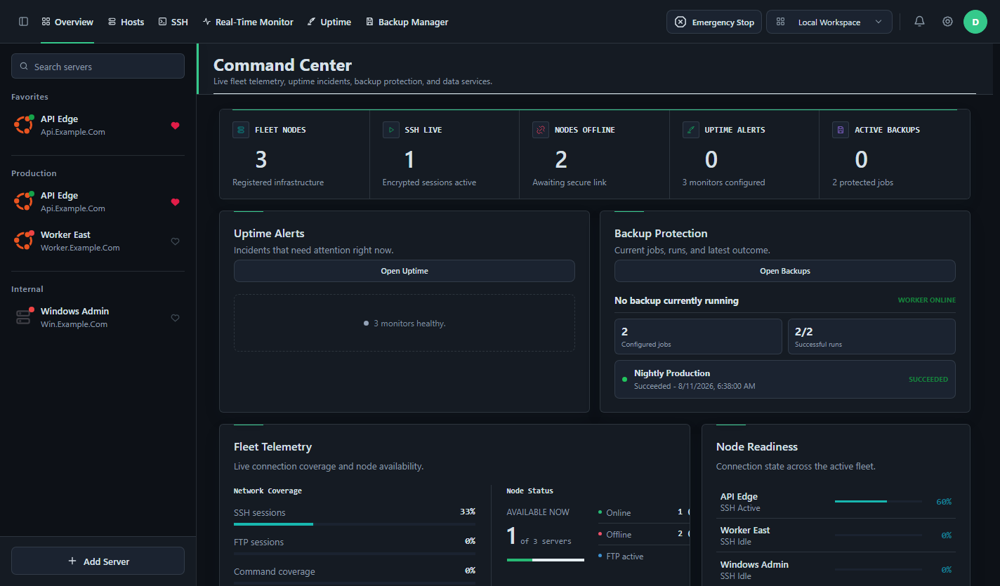

<p align="center">
  
</p>

<h1 align="center">DeployerX</h1>

<p align="center">
  <strong>Operations, deployment, and observability for the servers you control.</strong>
</p>

<p align="center">
  A local-first Windows workspace for SSH, SFTP, deployments, uptime monitoring,
  backups, and remote server administration.
</p>

<p align="center">
  <a href="https://github.com/me-devms/DeployerX/releases/latest"></a>
  <a href="https://github.com/me-devms/DeployerX/releases"></a>
  
  
  <a href="https://github.com/me-devms/DeployerX/issues"></a>
</p>

<p align="center">
  <a href="https://github.com/me-devms/DeployerX/releases/latest"><strong>Download DeployerX</strong></a>
  &nbsp;&middot;&nbsp;
  <a href="https://github.com/me-devms/DeployerX/issues">Report an issue</a>
</p>

<p align="center">
  
</p>

<p align="center"><sub>The DeployerX Command Center with sample infrastructure data.</sub></p>

## One workspace for infrastructure work

DeployerX brings the tools used throughout a server's lifecycle into one focused desktop application. Register a host once, then connect over SSH, browse files, run repeatable commands, watch availability, and manage protection workflows without moving between unrelated tools.

| Workspace | What it gives you |
| --- | --- |
| **Command Center** | Fleet health, active SSH sessions, uptime alerts, backup status, and quick navigation |
| **Hosts** | Searchable server inventory, groups, favorites, connection details, and saved commands |
| **SSH & SFTP** | Multi-tab terminals, per-user sessions, file browsing, transfers, folders, rename, and delete |
| **Real-Time Monitor** | Live CPU, memory, disk, network, process, and service visibility |
| **Uptime** | HTTP, TCP, and TLS checks with incidents, maintenance windows, reports, and notifications |
| **Backup Manager** | Jobs, sources, repositories, recovery points, retention policies, and verification |

## Built for daily operations

- Open an SSH terminal directly from the top navigation.
- Keep simultaneous terminal sessions clearly labeled by sequence and username.
- Save deployment commands per server and stream their output as they run.
- Browse remote files over SFTP without exposing plain FTP.
- Organize Linux and Windows hosts into groups and favorites.
- Connect to compatible Windows hosts through the embedded VNC workspace.
- Track endpoint incidents and backup health from the same command center.
- Work locally without an account, or configure an optional Firebase workspace for team sync.
- Expose bounded SSH, SFTP, monitoring, and uptime tools to trusted AI clients through a loopback-only MCP endpoint.
- Choose from light and dark themes designed for long operational sessions.

## What's new in v0.1.6

- Added the top-level **SSH** action for immediate terminal access.
- Made terminal tab numbering continuous after tabs are closed.
- Added usernames to terminal labels for multi-user server sessions.
- Corrected form, dashboard, search, toolbar, and button styling across every bundled theme.
- Improved server-list scrolling, search alignment, and SFTP path controls.
- Preserved exact file and directory name casing in remote browser rows.

Read the complete changes on the [v0.1.6 release page](https://github.com/me-devms/DeployerX/releases/tag/v0.1.6).

> [!NOTE]
> The Windows artifacts for v0.1.6 intentionally exclude the DeployerX DB Access Manager payload.

## Download

DeployerX is currently distributed for 64-bit Windows.

| Package | Use it when | Download |
| --- | --- | --- |
| **Setup** | You want Start Menu and desktop shortcuts with a normal installation | [DeployerX-0.1.6-Setup-x64.exe](https://github.com/me-devms/DeployerX/releases/download/v0.1.6/DeployerX-0.1.6-Setup-x64.exe) |
| **Portable** | You want to run DeployerX directly without installation | [DeployerX-0.1.6-Portable-x64.exe](https://github.com/me-devms/DeployerX/releases/download/v0.1.6/DeployerX-0.1.6-Portable-x64.exe) |

Windows may show a SmartScreen warning because the current release artifacts are unsigned. Confirm that the file came from this repository's release page before running it.

## Run from source

Requirements:

- Windows 10 or Windows 11
- Node.js LTS and npm
- Git

```powershell
git clone https://github.com/me-devms/DeployerX.git
cd DeployerX
npm install
npm start
```

Choose **Local Workspace** on first launch to use DeployerX without a hosted backend. Firebase configuration is optional and only required for cloud workspace features.

## Local-first by default

Server profiles, templates, settings, and operational data can remain on the current Windows user profile. DeployerX does not require a hosted service for local mode.

Optional cloud workspaces support team membership and synchronized workspace data. Sensitive SSH values are encrypted before cloud storage using a key derived from the team passphrase. Keep that passphrase in a separate password manager because DeployerX cannot recover it.

## Security model

- SSH and MCP credentials are resolved inside the desktop main process, not exposed as browser state.
- The MCP integration listens on `127.0.0.1` by default and requires bearer authentication.
- Remote backup connections support trusted SSH host-key checks.
- Cloud workspace secrets use authenticated encryption before synchronization.
- Emergency Stop provides one place to interrupt active operations.

Use least-privilege accounts, prefer SSH keys, verify host keys, review deployment commands, and test restores before relying on any backup workflow in production.

## Technology

DeployerX is built with Electron and Node.js. Its operational stack includes xterm.js, `ssh2`, SQLite, noVNC, Monaco, and provider SDKs for supported storage and workspace integrations.

```text
DeployerX/
|-- assets/                  Brand assets and product screenshots
|-- src/
|   |-- backup-manager/      Backup, retention, repository, and recovery workflows
|   |-- renderer/            Desktop interface, terminal, SFTP, and VNC views
|   |-- uptime-monitor/      Checks, incidents, workers, reports, and storage
|   |-- main.js              Electron lifecycle and IPC composition
|   |-- mcp-server.js        Authenticated local MCP endpoint
|   `-- preload.js           Sandboxed renderer bridge
|-- third_party_licenses/    Bundled dependency licenses
|-- package.json             Runtime and packaging configuration
`-- THIRD_PARTY_NOTICES.md   Third-party attribution
```

## Contributing

Focused bug reports and feature requests are welcome in [GitHub Issues](https://github.com/me-devms/DeployerX/issues). For code changes, create a branch, add relevant tests, run the focused checks for the affected module, and open a pull request describing the behavior and verification performed.

## License and attribution

Third-party software notices are recorded in [THIRD_PARTY_NOTICES.md](THIRD_PARTY_NOTICES.md), with license texts under `third_party_licenses/`.

This repository does not currently contain a top-level project license. Source availability should not be interpreted as permission to redistribute or create derivative works until the maintainer adds one.

<p align="center">
  Created and maintained by <a href="https://everythingx.in/">EverythingX</a>.
</p>
