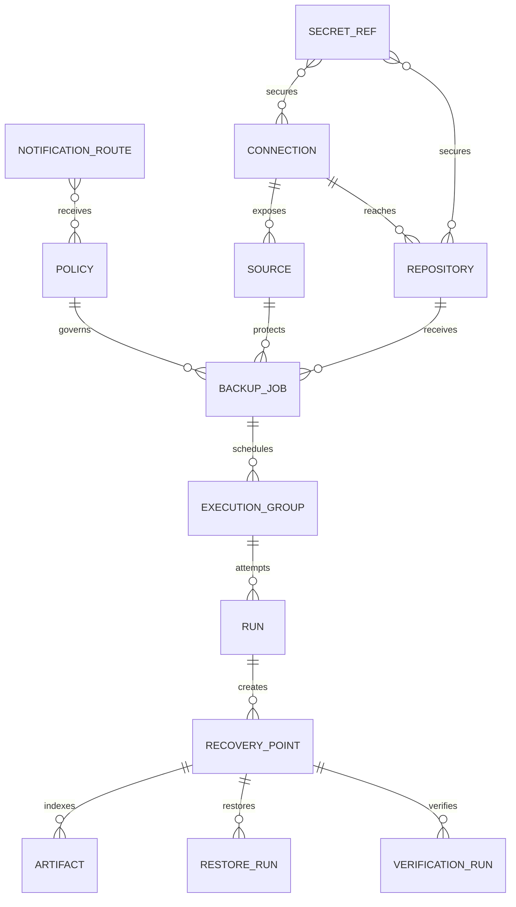
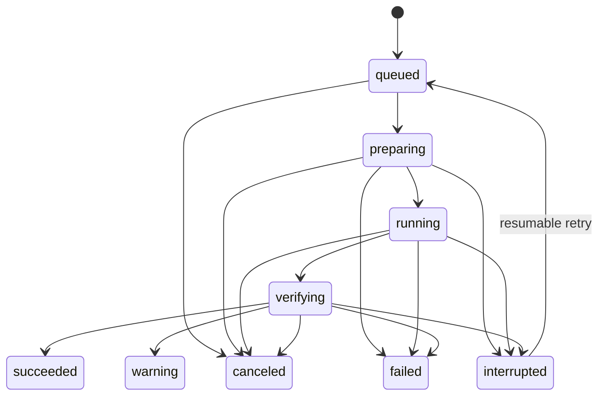

# Backup Manager Persisted Domain Model

## Document Status

- Task: `BM-003`
- Status: Defined
- Schema version: `1`
- Last updated: 2026-08-03

## Goals

The model must support local and workspace-scoped configuration, unattended workers, reproducible backup runs, immutable recovery history, point-in-time restore chains, retention, verification, auditability, and adapter evolution.

The repository catalog and backup data must remain recoverable if the DeployerX control database is lost. The local catalog is an operational index, not the only source of truth for stored recovery points.

## Persistence Boundaries

| Store | Contents | Authority |
| --- | --- | --- |
| `userData/backup-manager/control.db` | Configuration, schedules, jobs, run ledger, recovery-point index, verification results, and notification metadata | Transactional local control-plane database |
| Operating-system secure storage | Device-bound secret values and repository encryption keys | Authoritative secret store for local workers |
| Encrypted workspace storage | Workspace-scoped configuration and approved shared secret envelopes | Authoritative shared configuration when cloud mode is enabled |
| Backup repository | Encrypted backup data, manifests, restore-chain metadata, checksums, and repository format version | Authoritative recovery data |
| Worker runtime directory | Leases, transient checkpoints, resumable-transfer state, and bounded logs | Disposable execution state |

Do not add Backup Manager state to `projects.json` or `settings.json`. Those files are suitable for existing lightweight app state but do not provide the transactions, constraints, migrations, or queryability required by backup execution.

## Identity and Tenancy

- IDs are generated by the main process as UUIDv7 values with readable prefixes such as `src_`, `repo_`, `job_`, and `run_`.
- Every workspace-owned record has `workspaceId`. Local mode uses the reserved value `local`.
- Device-bound records also have `deviceId`; worker-bound records use `workerId`.
- All queries must constrain `workspaceId` before applying user-provided filters or identifiers.
- Timestamps are UTC ISO 8601 strings. Schedule time zones are stored separately as IANA identifiers.
- Mutable configuration records use integer `revision` values for optimistic concurrency.

## Common Record Fields

| Field | Type | Rule |
| --- | --- | --- |
| `id` | string | Immutable primary identifier |
| `workspaceId` | string | Required tenant boundary |
| `schemaVersion` | integer | Version of the stored record shape |
| `revision` | integer | Starts at 1 and increments on every mutation |
| `createdAt` | timestamp | Immutable creation time |
| `updatedAt` | timestamp | Last successful mutation time |
| `createdBy` | string | User, worker, or system actor ID |
| `updatedBy` | string | User, worker, or system actor ID |
| `deletedAt` | timestamp/null | Soft deletion for mutable configuration only |
| `labels` | object | Bounded user-defined metadata; secrets are forbidden |

## Entity Relationships

## Entities

### Connection

Represents a reusable way to reach a host, database endpoint, cloud account, cluster, or storage service.

| Field | Type | Notes |
| --- | --- | --- |
| `name` | string | Workspace-unique display name |
| `kind` | enum | `local`, `ssh`, `winrm`, `database`, `cloud`, `kubernetes`, `storage` |
| `adapterId` | string | Stable adapter identifier |
| `adapterVersion` | string | Version last used to validate the configuration |
| `scope` | enum | `device` or `workspace` |
| `endpoint` | object | Host, port, region, account, and other non-secret fields |
| `secretRefIds` | string[] | References only; never embedded secret values |
| `trust` | object | SSH host-key fingerprint or TLS validation requirements |
| `workerAffinity` | string[] | Empty means any compatible worker |
| `lastTest` | object/null | Status, timestamp, latency, adapter version, and safe error code |

### Source

Represents the workload being protected, independently of the connection used to reach it.

| Field | Type | Notes |
| --- | --- | --- |
| `name` | string | Workspace-unique display name |
| `connectionId` | string | Required connection |
| `sourceType` | enum | `files`, `database`, `kubernetes`, `volume`, `virtual-machine` |
| `adapterId` | string | Workload adapter responsible for consistency |
| `selector` | object | Paths, database instance, cluster namespace, or volume identity |
| `platform` | object | OS, database engine, version, and discovered metadata |
| `consistency` | object | Requested consistency, logical/physical method, backup mode, and coordinate capture |
| `physicalExecution` | object/null | Bounded SSH binding, native tools, service, data directory, archive directory, owner/group, and privilege mode for supported physical Sources |
| `enabled` | boolean | Disabled sources cannot start new jobs |
| `lastDiscovery` | object/null | Discovery time, status, and safe capability summary |

### Repository

Represents a backup destination and its repository-format configuration.

| Field | Type | Notes |
| --- | --- | --- |
| `name` | string | Workspace-unique display name |
| `connectionId` | string/null | Null only for a local repository |
| `adapterId` | string | Local, SFTP, S3-compatible, or future repository adapter |
| `engineId` | string | Versioned backup repository engine |
| `location` | object | Non-secret path, bucket, prefix, region, or remote directory |
| `secretRefIds` | string[] | Transport and repository credential references |
| `encryptionKeyRefId` | string | Required for client-side encrypted repositories |
| `immutability` | object | Mode, minimum retention, object-lock status, and validation time |
| `capacity` | object/null | Total, used, free, measured time, and quota |
| `health` | object | Status, last check, repository format, lock state, and safe error code |
| `maintenanceWindow` | object/null | Allowed prune and integrity-check window |

### Policy

Defines reusable scheduling, retention, verification, and operational behavior.

| Field | Type | Notes |
| --- | --- | --- |
| `name` | string | Workspace-unique display name |
| `enabled` | boolean | Disabled policies do not schedule jobs |
| `schedule` | object | Type, expression, IANA timezone, DST and missed-run behavior |
| `backupMode` | enum | `full`, `incremental`, `differential`, `forever-incremental`, `native` |
| `retention` | object | IANA timezone, keep-last-N, hourly/daily/weekly/monthly/yearly counts, and legal-hold safety flag |
| `verification` | object | Checksum, sample restore, full recovery-test cadence, and timeout |
| `performance` | object | Concurrency, bandwidth, priority, and maintenance constraints |
| `retry` | object | Maximum attempts, classified retry rules, and backoff |
| `hooks` | object | Approved pre/post hook references; raw secrets are forbidden |
| `objectives` | object | Optional independent 1-525,600-minute `rpoMinutes` and `rtoMinutes` targets |
| `notificationRouteIds` | string[] | Routes receiving selected events |

### BackupJob

Connects one source to one or more repositories under a policy.

| Field | Type | Notes |
| --- | --- | --- |
| `name` | string | Workspace-unique display name |
| `sourceId` | string | Exactly one primary source |
| `policyId` | string | Required policy |
| `repositoryBindings` | object[] | Ordered primary and copy repositories with adapter settings |
| `selection` | object | Paths, include/exclude rules, database objects, or namespaces |
| `consistency` | object | Snapshot, quiesce, native dump, log capture, and hook requirements |
| `adapterSettings` | object | Validated by the selected source adapter schema |
| `workerId` | string/null | Null allows compatible worker selection |
| `state` | enum | `draft`, `enabled`, `paused`, `disabled` |
| `nextRunAt` | timestamp/null | Scheduler projection, never the schedule source of truth |
| `lastSuccessfulRunId` | string/null | Cached summary reference |

Changing a job increments `revision`. Every run stores the job revision and a normalized configuration snapshot so historical recovery points remain reproducible.

Recovery-objective status is a derived workspace read model, not a persisted entity. RPO is calculated from the latest succeeded Run, or job creation before the first success. RTO is measured from the latest eligible succeeded/warning RestoreRun associated through a RecoveryPoint. See `RECOVERY_OBJECTIVES.md` for state and safe-projection rules.

### ExecutionGroup

Represents one manual/API request or one canonical schedule occurrence and groups every retry attempt.

| Field | Type | Notes |
| --- | --- | --- |
| `jobId` | string | Required backup job |
| `jobRevision` | integer | Job revision captured when the occurrence was created |
| `trigger` | enum | `manual`, `schedule`, `policy`, `api` |
| `scheduledFor` | timestamp/null | Canonical schedule occurrence; null for unscheduled work |
| `idempotencyKey` | string | Unique duplicate-prevention key |
| `state` | enum | `pending`, `running`, `succeeded`, `warning`, `failed`, `canceled` |
| `latestRunId` | string/null | Most recent attempt |
| `terminalRunId` | string/null | Attempt that determined the terminal result |

ExecutionGroup creation and the first Run creation occur in one transaction. Retry Runs retain the same group and configuration snapshot inputs.

### Run

Append-oriented execution record for backup and maintenance work.

| Field | Type | Notes |
| --- | --- | --- |
| `jobId` | string | Required backup job |
| `jobRevision` | integer | Revision executed by this run |
| `executionGroupId` | string | Groups the original attempt and all retries for one trigger occurrence |
| `scheduledFor` | timestamp/null | Canonical schedule occurrence; null for unscheduled manual work |
| `idempotencyKey` | string | Unique key preventing duplicate execution of the same occurrence/attempt |
| `trigger` | enum | `manual`, `schedule`, `retry`, `policy`, `api` |
| `workerId` | string | Worker that owns the run |
| `lease` | object/null | Owner, acquired time, heartbeat, and expiry |
| `state` | enum | See run state machine below |
| `attempt` | integer | Starts at 1 |
| `parentRunId` | string/null | Original run for retries or continuation |
| `retryOfRunId` | string/null | Terminal Run selected for a fresh user retry |
| `configSnapshot` | object | Redacted normalized job, policy, and adapter configuration |
| `progress` | object | Phase, items, bytes, throughput, deduplication, and ETA |
| `cancellation` | object/null | Requested time, actor ID, safe reason code, and acknowledgment time |
| `startedAt` | timestamp/null | Worker start time |
| `finishedAt` | timestamp/null | Terminal completion time |
| `result` | object/null | Recovery-point IDs, warnings, safe error code, and log reference |

### RecoveryPoint

Immutable catalog record for a restorable point or restore-chain segment.

| Field | Type | Notes |
| --- | --- | --- |
| `jobId` | string | Originating job |
| `sourceId` | string | Protected workload identity |
| `runId` | string | Run that produced the point |
| `type` | enum | `full`, `incremental`, `differential`, `synthetic-full`, `log`, `snapshot` |
| `consistency` | enum | `application`, `crash`, `filesystem`, `unknown` |
| `chainRootId` | string | Root of the required restore chain |
| `parentRecoveryPointId` | string/null | Previous required chain segment |
| `capturedFrom` | timestamp | Earliest represented workload time |
| `capturedTo` | timestamp | Latest represented workload time |
| `pointInTime` | object/null | Bounded MySQL/MariaDB binary-log coordinates, PostgreSQL WAL timeline/segment bounds, or SQL Server LSN/recovery-fork evidence used to project a recoverable window without repository locators |
| `repositoryCopies` | object[] | Repository, engine snapshot ID, state, and immutable-until time |
| `verification` | object | Last result, mode, time, and verification-run ID |
| `retention` | object | Expiry, rule matches, legal hold, and deletion eligibility |
| `manifestChecksum` | string | Detects catalog or manifest mismatch |

Recovery points are never updated except for verification summary, copy status, retention calculation, or deletion tombstone fields. Their identity, source, times, type, and restore-chain relationships are immutable.

### Artifact

Indexes repository objects required by a recovery point without duplicating repository engine internals.

| Field | Type | Notes |
| --- | --- | --- |
| `recoveryPointId` | string | Owning recovery point |
| `repositoryId` | string | Repository containing the object |
| `kind` | enum | `manifest`, `data`, `database-dump`, `physical-backup`, `transaction-log`, `schema`, `metadata`, `index` |
| `locator` | string | Opaque engine locator; never a secret-bearing URL |
| `sizeBytes` | integer | Stored size when known |
| `checksum` | object | Algorithm and digest |
| `encryption` | object | Algorithm and key version, not key material |
| `compression` | object/null | Algorithm and optional level |

### RestoreRun

Append-oriented record of a restore request and its outcome.

| Field | Type | Notes |
| --- | --- | --- |
| `recoveryPointIds` | string[] | Complete ordered recovery chain |
| `targetConnectionId` | string | Original or alternate destination |
| `target` | object | Redacted path, database, cluster, or volume destination; PostgreSQL physical recovery includes its normalized recovery target and Source binding, while SQL Server native recovery records the target Source/database, UTC target, tail mode, and resulting tail RecoveryPoint ID |
| `mode` | enum | `original`, `alternate`, `new-database`, `download`, `isolated-test` |
| `conflictPolicy` | enum | `fail`, `overwrite`, `rename`, `skip` |
| `requestedPointInTime` | timestamp/null | Timestamp-only PITR target where applicable; engine-native target details remain in the bounded `target` record |
| `workerId` | string | Restore worker |
| `state` | enum | `queued`, `preparing`, `running`, `validating`, terminal state |
| `progress` | object | Items, bytes, phase, throughput, and ETA |
| `validation` | object/null | Adapter-native integrity, connectivity, and application checks |
| `result` | object/null | Safe summary, warnings, error code, and report reference |

### VerificationRun

Records repository checks, sampled restores, and isolated recovery drills.

| Field | Type | Notes |
| --- | --- | --- |
| `scopeType` | enum | `repository`, `job`, `recovery-point` |
| `scopeId` | string | ID selected by `scopeType` |
| `mode` | enum | `checksum`, `sample-restore`, `full-restore`, `application-validation`, or an adapter-owned mode such as `mongodb-recovery-drill` |
| `recoveryPointId` | string/null | Exact point tested when applicable |
| `workerId` | string | Verification worker |
| `state` | enum | `queued`, `running`, `succeeded`, `warning`, `failed`, `canceled`, `interrupted` |
| `startedAt` | timestamp/null | Execution start |
| `finishedAt` | timestamp/null | Terminal time |
| `measuredRtoSeconds` | integer/null | Available for completed recovery drills |
| `evidence` | object | Checks performed, sample counts, checksums, isolation/cleanup proof for drills, and safe report reference |

### SecretRef

Stores secret metadata and a provider locator, never the secret value.

| Field | Type | Notes |
| --- | --- | --- |
| `name` | string | Human-readable purpose |
| `provider` | enum | `electron-safe-storage`, `workspace-vault`, `external-vault` |
| `scope` | enum | `device` or `workspace` |
| `providerKey` | string | Opaque lookup key |
| `secretType` | enum | `password`, `private-key`, `token`, `access-key`, `encryption-key`, `certificate` |
| `version` | integer | Increments on rotation |
| `fingerprint` | string/null | Non-secret comparison fingerprint |
| `expiresAt` | timestamp/null | Credential expiry when known |
| `lastValidatedAt` | timestamp/null | Most recent successful use/test |

Deleting a referenced secret is prohibited. Rotation creates a new provider version and preserves the old version while active runs or recovery points still require it.

### NotificationRoute

Defines where operational events are delivered.

| Field | Type | Notes |
| --- | --- | --- |
| `name` | string | Workspace-unique display name |
| `type` | enum | `desktop`, `email`, `webhook`, `slack`, `teams` |
| `config` | object | Non-secret destination configuration |
| `secretRefIds` | string[] | Authentication references |
| `events` | string[] | Allowed event identifiers |
| `enabled` | boolean | Disabled routes receive nothing |
| `lastDelivery` | object/null | Status, time, and safe error code |
| `deliveryHistory` | object[] | Newest 100 idempotent attempts with bounded provider-safe evidence |

SMTP passwords and complete webhook URLs are stored only through device-bound SecretRefs. Public projections expose SMTP routing metadata or webhook destination host, never the secret value. Route deletion atomically unbinds Policies before the route and its secrets are removed.

### WorkerRegistration

Tracks a worker's identity and declared execution capacity without storing transient process handles.

| Field | Type | Notes |
| --- | --- | --- |
| `workerId` | string | Immutable worker identity |
| `deviceId` | string | Device installation identity |
| `name` | string | Workspace-visible worker name |
| `scope` | enum | `device` or `workspace` |
| `protocolVersion` | integer | Worker protocol compatibility version |
| `workerVersion` | string | Worker semantic version |
| `platform` | object | OS, architecture, hostname fingerprint, and runtime version |
| `capabilities` | object | Adapter versions, executables, privileges, and resource limits |
| `state` | enum | `online`, `draining`, `offline`, `disabled`, `incompatible` |
| `lastHeartbeatAt` | timestamp/null | Last accepted heartbeat using control-plane time |
| `lastSeenAddress` | string/null | Redacted/locality-safe endpoint identity, not a credential-bearing URL |

## Run State Machine

- Terminal states are `succeeded`, `warning`, `failed`, and `canceled`.
- `interrupted` is nonterminal until retry policy is exhausted; then it transitions to `failed` with an interruption error code.
- A run may create a recovery point only after the repository commit succeeds.
- `succeeded` requires committed manifests and configured verification. `warning` means restorable output exists but a nonfatal policy check failed.

## Referential and Deletion Rules

1. A Connection cannot be deleted while an active Source or Repository references it.
2. A Source, Repository, or Policy cannot be deleted while an enabled job references it.
3. A Repository cannot be deleted from the catalog while retained recovery-point copies reference it.
4. A BackupJob with runs is soft-deleted; its historical normalized snapshots remain readable.
   Deletion requires an idle disabled job. Its Policy is deleted only when no other active job references it.
5. Run, RestoreRun, and VerificationRun records are append-oriented and cannot be edited through ordinary CRUD APIs.
6. Recovery-point deletion requires retention eligibility, no legal hold, repository deletion success or an explicit missing-copy tombstone, and an audit event.
7. Artifact rows are deleted only with their recovery-point copy after repository deletion is confirmed.
8. SecretRef deletion is blocked while referenced by configuration, an active run, or a retained recovery point requiring that key version.

## Required Constraints and Indexes

- Unique within each active named-configuration table: `(workspaceId, name)` where `deletedAt IS NULL`.
- Unique: ExecutionGroup `(workspaceId, idempotencyKey)` for manual/API and scheduler deduplication.
- Unique when scheduled: ExecutionGroup `(workspaceId, jobId, scheduledFor)`.
- Unique: `(workspaceId, repositoryId, engineSnapshotId)` for repository copies.
- Index: Run by `(workspaceId, state, createdAt)` and `(jobId, createdAt)`.
- Index: RecoveryPoint by `(jobId, capturedTo)`, `(sourceId, capturedTo)`, and `retention.expireAt`.
- Index: RestoreRun and VerificationRun by state and creation time.
- Index: records by `deletedAt` for cleanup and filtered active queries.
- Foreign keys are enabled and checked after every migration.

## Configuration Snapshots

Each Run stores a redacted `configSnapshot` containing:

- job ID and revision;
- source and repository adapter IDs and versions;
- normalized selection and consistency settings;
- policy schedule, backup mode, retention, retry, verification, and performance settings;
- referenced secret IDs and versions, never values;
- worker capability version;
- repository engine and format version.

This snapshot is immutable and permits later diagnosis without silently applying current job settings to historical runs.

## Cloud Synchronization Rules

- Connections, Sources, Repositories, Policies, BackupJobs, SecretRef metadata, and NotificationRoutes may be workspace-synchronized.
- Device secret values, worker leases, checkpoints, detailed local logs, and transient progress never synchronize.
- Run and recovery summaries may synchronize after commit, but the executing worker ledger is authoritative during execution.
- Conflict resolution for mutable records uses `revision`, `updatedAt`, and actor ID; equal-revision divergent updates require user resolution.
- Repository manifests remain authoritative for disaster reconstruction even when cloud summaries exist.

## Migration Rules

1. `control.db` uses a database-level schema version plus record-level `schemaVersion`.
2. Migrations are ordered, forward-only, transactional, and idempotent.
3. DeployerX creates a timestamped database copy before a migration that changes or rewrites stored data.
4. Startup stops Backup Manager workers if the database schema is newer than the application supports.
5. A failed migration rolls back fully and leaves the previous database usable.
6. Post-migration checks include foreign keys, required indexes, orphan counts, and a sample configuration decode.
7. Repository formats have independent compatibility versions and are never migrated implicitly with the control database.

## Export and Account-Backup Boundary

- Existing Settings > Backup & Restore continues to handle DeployerX account/workspace application data.
- Backup Manager configuration export is a separate future operation and excludes secret values, run logs, backup payloads, and repository encryption keys by default.
- Import validates adapter availability, schema compatibility, workspace ownership, and unresolved SecretRefs before enabling jobs.
- Recovery data is exported or copied through repository-aware operations, not through DeployerX account export.

## Non-Negotiable Invariants

1. No persisted configuration, log, event, or snapshot contains plaintext credentials or repository encryption keys.
2. No recovery point is advertised before its repository manifest is committed.
3. No successful run references an incomplete restore chain.
4. No retention deletion bypasses legal hold or immutable-until constraints.
5. No job mutation changes the configuration snapshot of a historical run.
6. No workspace query may return another workspace's records.
7. No local catalog loss makes repository backup data intrinsically unrestorable.
